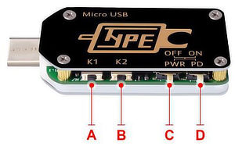

<!-- markdownlint-disable no-inline-html first-line-h1 -->
<p>
  
  
</p>
<!-- markdownlint-enable no-inline-html -->

# TC66C – MQTT Bridge

A simple TC66C to MQTT bridge I'm using to keep track of my Raspberry Pi4's
electrical load in
[Home Assistant](https://github.com/thijsputman/home-assistant-config).

Simultaneously, a playground for me to get more familiar with some advanced
Docker/container concepts and to dust off my Node.js knowledge.

It publishes measurements of voltage, current and power usage to the `tc66c`
MQTT-topic at a configurable interval.

- [Prerequisites](#prerequisites)
  - [TC66C](#tc66c)
  - [Hardware & OS](#hardware--os)
- [Usage](#usage)
  - [MQTT](#mqtt)
  - [Docker](#docker)
  - [Long-running service](#long-running-service)
- [To-do](#to-do)

## Prerequisites

### TC66C

The TC66C is a USB-C load meter that communicates its measurements over
Bluetooth Low Energy –
[you'll need one of them](https://www.aliexpress.com/item/32968303350.html) to
be able to retrieve actual measurements...



After prolonged periods of use (and/or after repeatedly
connecting/disconnecting), the TC66C may stop accepting Bluetooth connections
(_or_, might still accept connections, but refuse to respond to any subsequent
commands issued).

The easiest way to recover from this, is to toggle the dip-switch marked **C**
in the above picture back and forth. This switches the TC66C from drawing power
over USB-C to its (unpowered) micro USB port, effectively resetting the unit
(_without_ cutting power to the device connected to the TC66C's USB-C port).

For more details regarding the TC66C, see [`📄 docs/TC66C.md`](./docs/TC66C.md).

### Hardware & OS

The code most likely works on any Linux-system with BlueZ properly configured.
The only tested/supported configuration is the following though:

1. Raspberry Pi 4 Model B
2. Ubuntu 20.04 or 20.10 (`aarch64`)
   - Ensure you Bluetooth-stack is working (i.e. `apt install pi-bluetooth` and
     reboot)

## Usage

1. `npm install`
2. Follow the [`node-ble`](https://github.com/chrvadala/node-ble) instructions
   to properly configure D-Bus
3. `./index.js ble-address mqtt-broker [--interval ms] [--logLevel level] [--deviceAlias alias]`

The default `interval` at which measurements are fetched and returned is 2,000
ms. Use `--interval 0` to disable the interval and fetch measurements as fast as
possible. The maximum retrieval speed appears mainly dependent on the hardware
revision of your TC66C unit. The newer units (firmware 1.15) return in around
500 ms, the older units (firmware 1.14) in around 800 ms.

The default `logLevel` is `info`. You can optionally change it into `debug` to
get (a lot) more output, or to `warn` or `error` to get virtually no feedback.

The `deviceAlias` is used to uniquely identify the TC66C unit in the MQTT-topic.
It defaults to the unit's Bluetooth MAC address (lower-cased, with all colons
replaced by underscores – e.g., `12_34_56_78_90_fe`).

To terminate the script, send a `SIGTERM` or `SIGINT` (`Ctrl`+`C`). The script
will attempt a graceful exit with status code `0`. If that fails, sending either
`SIGTERM` or `SIGINT` again will instruct Node.js to forcefully terminate the
script.

If something goes (unexpectedly) wrong during execution, the script will attempt
a graceful exit with status code `1` instead.

### MQTT

Once running, the script will publish the following measurements to the `tc66c`
MQTT-topic at the configured `interval`:

- `tc66c/deviceAlias/voltage_V` – voltage in Volt
- `tc66c/deviceAlias/current_A` – current in Ampere
- `tc66c/deviceAlias/power_W` – power usage in Watt

#### Testing the MQTT output

Run the following command in another shell (or on another machine) to subscribe
to the `tc66c/#` topic (using [Mosquitto](https://mosquitto.org/)) to validate
the measurements are sent out properly.

```shell
mosquitto_sub -h <mqtt-broker> -t "tc66c/#"
```

### Docker

Alternatively, you can use
[the pre-built Docker image](https://hub.docker.com/r/thijsputman/tc66c-mqtt).
Note that the Docker image currently is only available for **`aarch64`**!

In this case, there's no need to `npm install` nor to configure D-Bus.

For things to work in Docker, you _do_ need to load
[a custom AppArmor-policy](./docker/docker-ble) prior to starting the container:

```shell
sudo apparmor_parser -r -W ./docker/docker-ble
```

The AppArmor-policy needs to be reloaded after each system boot. There are many
ways to automate this, one would be:

```shell
sudo mkdir -p /etc/apparmor.d/containers && sudo cp ./docker/docker-ble "$_"
sudo crontab -e
# Insert the following into the crontab:
@reboot  /usr/sbin/apparmor_parser -r -W /etc/apparmor.d/containers/docker-ble
```

Once you've loaded the AppArmor-policy, the easiest way to get it up and running
is via `docker-compose up [-d]`:

`📄 docker-compose.yml`

```yaml
version: "3.7"
services:
  tc66c-mqtt:
    image: thijsputman/tc66c-mqtt:latest
    security_opt:
      - apparmor=docker-ble
    volumes:
      - /var/run/dbus/system_bus_socket:/var/run/dbus/system_bus_socket
    environment:
      - TC66C_BLE_MAC=
      - MQTT_BROKER=
    # - M_INTERVAL=
    # - LOG_LEVEL=
    # - DEVICE_ALIAS=
    # - PUID=
    # - PGID=
```

#### Environment variables

- `TC66C_BLE_MAC` – Bluetooth MAC address of your TC66C
- `MQTT_BROKER` – Hostname or IP address of your MQTT broker
- `M_INTERVAL` – Optional; measurement interval (in milliseconds)
  - Leaving it empty will use the default interval of 2,000 ms
  - Set it to `0` to retrieve measurements as fast as possible
- `LOG_LEVEL` – Optional; logging verbosity
  - Defaults to `info`; alternatives are `debug`, `warn` and `error`
- `DEVICE_ALIAS` – Optional; custom device name to use in the MQTT-topic
  - Defaults to unit's Bluetooth MAC address (e.g. `12_34_56_78_90_fe`)
- `PUID` & `PGID` – Optional; run under the specified UID and GID (instead of as
  `root`)

#### Docker and Bluetooth

See [`📄 docker/README.md`](./docker/README.md#docker-and-bluetooth) for all the
ins and outs with regards to using Bluetooth in a Docker container.

### Long-running service

Personally I'm using the TC66C to provide some insight into the power
consumption of my Raspberry Pi 4 "home server". The script is running inside a
Docker container alongside the Home Assistant and mosquitto containers.

I've increased `M_INTERVAL` interval to `60` (as I'm graphing power consumption
over a 24-hour period) and set `LOG_LEVEL` to `warn` to reduce the amount of
chatter in the output of `docker-compose logs`.

A failure of the script terminates the container. To ensure the script keeps
running (i.e. the container is automatically restarted) add the following to
`📄 docker-compose.yml`:

```yaml
restart: unless-stopped
```

## To-do

See [`📄 TODO`](./TODO).
